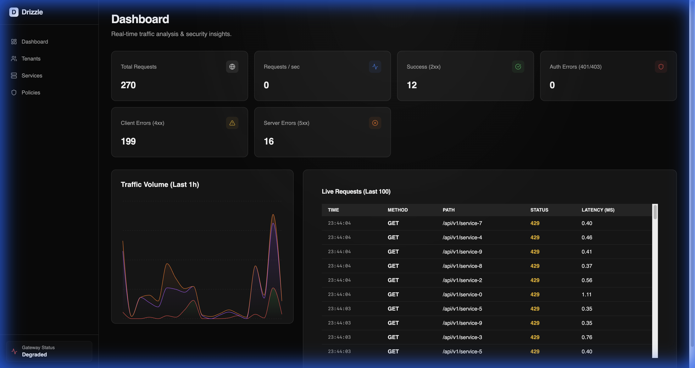

# Drizzle Gateway by IronLattice Labs

**Drizzle Gateway** is an enterprise-grade, multi-tenant, programmable API gateway and zero-trust access proxy built on [Pingora](https://github.com/cloudflare/pingora).  
It is designed for extensibility, security, and observability from day one.

## Security & Resilience
Drizzle includes built-in mechanisms to protect against common attacks:
*   **IP-Based Rate Limiting**: Automatically limits requests per IP (Default: 100 RPS, 50 Burst) using a Token Bucket algorithm.
*   **Timeouts**: Enforces strict timeouts (3s connect, 5s read/write) on upstream connections to prevent resource exhaustion.
*   **Zero Trust Authorization**: "Default Deny" policy engine powered by Cedar Agent.

## Architecture
Drizzle consists of three main components:
*   **Control Plane (Admin API)**: Manages configuration (Tenants, Services, Routes, Policies).
*   **Data Plane (Gateway)**: High-performance proxy based on Pingora.
*   **Console**: React-based dashboard for management and observability.

---

## 🚀 Features
- **Data Plane**: High-performance reverse proxy using Cloudflare's Pingora.
- **Control Plane**: Centralized management with Postgres persistence.
- **Dynamic Configuration**: Hot-reloading of routing rules via polling.
- **Zero-Trust Security**:
    - **Authentication**: API Key support.
    - **Authorization**: Fine-grained policies via Cedar Policy Engine.
    - **Rate Limiting**: Distributed Token Bucket algorithm.
- **Observability**: Prometheus metrics, health probes, and structured logging.
- **Multi-Tenant**: Native support for multiple tenants and routes.

---

## 📂 Project Structure
```
drizzle/
├── gateway/               # Data plane (fast path)
│   ├── crates/
│   │   ├── proxy          # Core proxy engine + Poller
│   │   └── snapshot       # Shared configuration format
│   └── bin/
│       └── gatewayd       # Gateway daemon
│
├── control-plane/         # Management plane
│   ├── crates/
│   │   ├── domain         # DDD domain models
│   │   └── storage        # Persistence (Postgres/sqlx)
│   ├── services/
│   │   └── admin-api      # REST Admin API
│   └── bin/
│       └── admin-cli      # CLI Management Tool
│
└── scripts/               # Helper scripts
    ├── init_db.sh         # Start Postgres & migrate
    ├── run_admin.sh       # Run Admin API
    ├── run_gateway.sh     # Run Gateway
    └── verify_e2e.sh      # E2E health check
```

---

## 🛠️ Development

### Prerequisites
- [Rust](https://www.rust-lang.org/tools/install) (latest stable)
- [Docker](https://www.docker.com/) (for Postgres database)
- [sqlx-cli](https://github.com/launchbadge/sqlx) (optional, installed by init script)

### Getting Started

1. **Initialize Database**
   Starts a Postgres container on port 5442 and runs migrations.
   ```bash
   ./scripts/init_db.sh
   ```

2. **Run Control Plane**
   Starts the Admin API on port 3000.
   ```bash
   ./scripts/run_admin.sh
   ```

3. **Manage Configuration (CLI)**
   Use the CLI to create tenants, services, and routes.
   ```bash
   cargo run -q -p admin-cli -- --help
   ```

4. **Run Data Plane**
   Starts the Gateway on port 6188 (polls Admin API every 10s).
   ```bash
   ./scripts/run_gateway.sh
   ```

### Dashboard Layout


### Testing

```bash
# Run unit tests
./scripts/test_domain.sh
./scripts/test_snapshot.sh

# Run storage integration tests (requires DB up)
cargo test -p storage

# Verify Observability
./scripts/test_observability.sh

# Verify E2E (requires Admin API & Gateway running)
./scripts/verify_e2e.sh
```

---

## 🧭 Roadmap
- [x] MVP Data Plane (Pingora integration)
- [x] Control Plane (Admin API, Postgres Persistence)
- [x] Dynamic Configuration (Polling Distribution)
- [x] Advanced Routing (Host/Path matching)
- [x] Admin CLI
- [x] Zero Trust Layer (API Key, Cedar, Rate Limits)
- [x] Observability (Metrics, Health, Logging)
- [x] Console UI

---

## 🏢 About IronLattice Labs
**IronLattice Labs** is committed to building secure, performant, and programmable infrastructure for the next generation of enterprise APIs.
